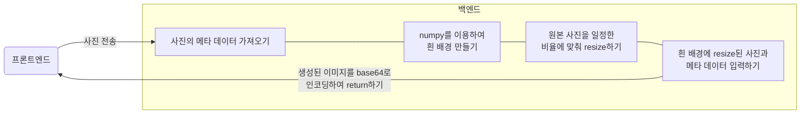

<<<<<<< HEAD
이 웹사이트는 [Next.js](https://nextjs.org/)를 사용해 만들어졌습니다.

## 이 사이트를 만든 목적

인스타그램에 자신이 찍은 사진을 올릴 때, 원본 그대로 올리는 것 보다 그 사진의 [EXIF](https://namu.wiki/w/EXIF)(셔터 스피드, 조리개 값, ISO등)를 입력해 놓음으로써 사람들이 정보를 알 수 있게 되는 프레임을 만드는 것이 유행이다.  
그러나, 이 작업은 포토샵으로 일일이 입력해야 하다는 것이 단점이었다. 그래서 이 작업을 Python 코드로 자동화하여 사용자에게 제공하면 더욱 편리하겠다는 생각을 하여 만들었다.


## Getting Started

먼저, 로컬 서버에서 다음의 커맨드를 실행한다:
=======
This is a [Next.js](https://nextjs.org) project bootstrapped with [`create-next-app`](https://nextjs.org/docs/app/api-reference/cli/create-next-app).

## Getting Started

First, run the development server:
>>>>>>> 72d1a71 (Next Js 15 업데이트)

```bash
npm run dev
# or
yarn dev
# or
pnpm dev
# or
bun dev
```

<<<<<<< HEAD
로컬 주소 [http://localhost:3000](http://localhost:3000)에 접속하여 결과물을 확인한다.

## 주요 Python 코드

```python
meta_data_list = ['Model', 'ExposureTime', 'ISOSpeedRatings', 'FNumber']
meta_data = {}


def get_image_exif(image):
    img = Image.open(image)

    img_info = img._getexif()
    for tag_id in img_info:
        tag = TAGS.get(tag_id, tag_id)
        data = img_info.get(tag_id)
        if tag in meta_data_list:
            meta_data[tag] = data
    img.close()

            ⋮

frame_h, frame_w = 1350, 1080
h, w, c = img.shape
if h > w:  # 세로 사진
    n_w = round(1080 / 1.6)
    x = round((frame_w // 2) - (n_w // 2))
    y = 70
    n_h = round((h / w) * n_w)
else:  # 가로 사진
    n_w = round(1080 / 1.4)
    x = round((frame_w // 2) - (n_w // 2))
    y = 200
    n_h = round((h / w) * n_w)

white_background = np.zeros((frame_h, frame_w, 3), np.uint8)
white_background.fill(255)

new_img = cv2.resize(img, (n_w, n_h))
white_background[y:y + n_h, x:x + n_w, :] = new_img
```

## 로직


=======
Open [http://localhost:3000](http://localhost:3000) with your browser to see the result.

You can start editing the page by modifying `app/page.tsx`. The page auto-updates as you edit the file.

This project uses [`next/font`](https://nextjs.org/docs/app/building-your-application/optimizing/fonts) to automatically optimize and load [Geist](https://vercel.com/font), a new font family for Vercel.

## Learn More

To learn more about Next.js, take a look at the following resources:

- [Next.js Documentation](https://nextjs.org/docs) - learn about Next.js features and API.
- [Learn Next.js](https://nextjs.org/learn) - an interactive Next.js tutorial.

You can check out [the Next.js GitHub repository](https://github.com/vercel/next.js) - your feedback and contributions are welcome!

## Deploy on Vercel

The easiest way to deploy your Next.js app is to use the [Vercel Platform](https://vercel.com/new?utm_medium=default-template&filter=next.js&utm_source=create-next-app&utm_campaign=create-next-app-readme) from the creators of Next.js.

Check out our [Next.js deployment documentation](https://nextjs.org/docs/app/building-your-application/deploying) for more details.
>>>>>>> 72d1a71 (Next Js 15 업데이트)
